<div align="center">


</div>

---

## About

FleetPulse is a full-stack IoT fleet telemetry platform that mirrors the core architecture of real-world vehicle tracking products. It demonstrates the complete data lifecycle — from simulated device ingestion through to a live operations dashboard.

A **C# `BackgroundService`** continuously updates vehicle telemetry and generates safety alerts every few seconds, simulating what a real IoT edge device would push over MQTT or HTTP. That data flows through an **ASP.NET Core REST API** backed by **SQLite via EF Core**, and is visualised in a **React + TypeScript dashboard** that auto-refreshes, shows live JSON from every API call, and lets you drill into individual vehicle telemetry on demand.

The goal: prove end-to-end ownership across data modelling, API design, background processing, and frontend — the exact stack Powerfleet-class platforms run on.

---

## Architecture

```
┌──────────────────────────────────────────────────────────────┐
│  FleetPulse.Api  ·  C# ASP.NET Core 8  ·  port 5112         │
│                                                              │
│  ┌──────────────────────────┐   ┌────────────────────────┐  │
│  │  TelemetrySimulator      │   │  EF Core + SQLite       │  │
│  │  BackgroundService       │──▶│  Vehicles (24)          │  │
│  │  · Speed / fuel every 10s│   │  TelemetryRecords       │  │
│  │  · New alert every ~30s  │   │  Alerts                 │  │
│  └──────────────────────────┘   └────────────────────────┘  │
│                                                              │
│  GET /api/vehicles          GET /api/alerts                  │
│  GET /api/fleet/summary     GET /api/telemetry/summary       │
└──────────────────────────────┬───────────────────────────────┘
                               │  JSON over HTTP
                               ▼
┌──────────────────────────────────────────────────────────────┐
│  fleetpulse-frontend  ·  React + TypeScript  ·  port 5173    │
│                                                              │
│  Gateway Portal  →  Dashboard  →  Vehicle Detail Modal       │
│  Live API Console  ·  Fleet Performance  ·  Auto-refresh 15s │
└──────────────────────────────────────────────────────────────┘
```

---

## Features

- **Live telemetry simulation** — `TelemetrySimulatorService` (C# `BackgroundService`) updates vehicle speed and fuel every 10 seconds and generates typed safety alerts (speeding, harsh braking, geofence breach, low fuel) every ~30 seconds — all written directly to SQLite
- **REST API with Swagger** — four typed endpoints, fully documented at `/swagger`
- **Gateway portal** — animated entry screen with links to the dashboard and API explorer
- **Vehicle drill-down** — click any vehicle to open a modal that fetches its monthly telemetry summary live from the API
- **Live API console** — sidebar that shows the real JSON payloads returned by the backend on every refresh cycle
- **Fleet performance metrics** — Safety, Compliance, Fuel Efficiency, Utilisation bars driven by real aggregate data
- **Auto-refresh** — dashboard polls all endpoints every 15 seconds; manual refresh available

---

## API Endpoints

| Method | Endpoint | Description |
|--------|----------|-------------|
| `GET` | `/api/vehicles` | All vehicles with live status, speed, fuel level |
| `GET` | `/api/alerts` | Safety alerts from the last 24 hours |
| `GET` | `/api/fleet/summary` | Aggregate KPIs — safety score, utilisation, fuel avg |
| `GET` | `/api/telemetry/summary?vehicleId=1&month=4` | Monthly telemetry for a vehicle |

Interactive docs: **http://localhost:5112/swagger**

---

## Tech Stack

| Layer | Technology |
|-------|-----------|
| Backend API | C# · ASP.NET Core 8 · Minimal API pattern |
| ORM | Entity Framework Core 8 |
| Database | SQLite |
| Background jobs | `IHostedService` / `BackgroundService` |
| Frontend | React 18 · TypeScript · Vite |
| Styling | Tailwind CSS v4 |
| Animations | Framer Motion |
| Icons | Lucide React |

---

## Getting Started

### Prerequisites
- [.NET 8 SDK](https://dotnet.microsoft.com/download/dotnet/8.0)
- [Node.js 18+](https://nodejs.org/)

### One-click start (Windows)
```powershell
.\start-fleetpulse.ps1
```
Opens both servers and launches the browser automatically.

### Manual setup

**Backend**
```bash
cd FleetPulse.Api
dotnet run --launch-profile http
# → http://localhost:5112
# → http://localhost:5112/swagger
```

**Frontend**
```bash
cd fleetpulse-frontend
npm install
npm run dev
# → http://localhost:5173
```

The database (`fleet.db`) is created and seeded automatically on first run via EF Core.

---

## Project Structure

```
fleetpulse/
├── FleetPulse.Api/
│   ├── Controllers/
│   │   ├── VehiclesController.cs
│   │   ├── AlertsController.cs
│   │   ├── FleetController.cs
│   │   └── TelemetryController.cs
│   ├── Data/
│   │   └── FleetDbContext.cs          # EF Core context + seed data
│   ├── Models/
│   │   ├── Vehicle.cs
│   │   ├── Alert.cs
│   │   └── TelemetryRecord.cs
│   ├── Services/
│   │   └── TelemetrySimulatorService.cs   # BackgroundService
│   └── Program.cs
│
├── fleetpulse-frontend/
│   └── src/
│       ├── App.tsx                    # Portal + Dashboard + Modal
│       ├── api.ts                     # Typed fetch wrappers
│       └── types.ts                   # TypeScript interfaces
│
├── assets/
│   └── banner.svg                     # Animated project banner
├── start-fleetpulse.ps1               # One-click launcher
└── README.md
```

---

## Why This Mirrors Real Fleet Telematics

| Industry concept | Implementation |
|-----------------|---------------|
| IoT device data ingestion | `TelemetrySimulatorService` writing to SQLite every 10s |
| Fleet management database | Normalised schema — Vehicles, TelemetryRecords, Alerts |
| REST API layer | Typed C# controllers with EF Core queries |
| Operations dashboard | React dashboard consuming live API |
| Safety event detection | Alert generation for speeding, harsh braking, geofence, low fuel |
| Monthly reporting | `/api/telemetry/summary` aggregating per-vehicle per-month |

---

*Built as a Powerfleet interview demo — demonstrating C# API development, EF Core data modelling, background services, and React dashboard construction.*
